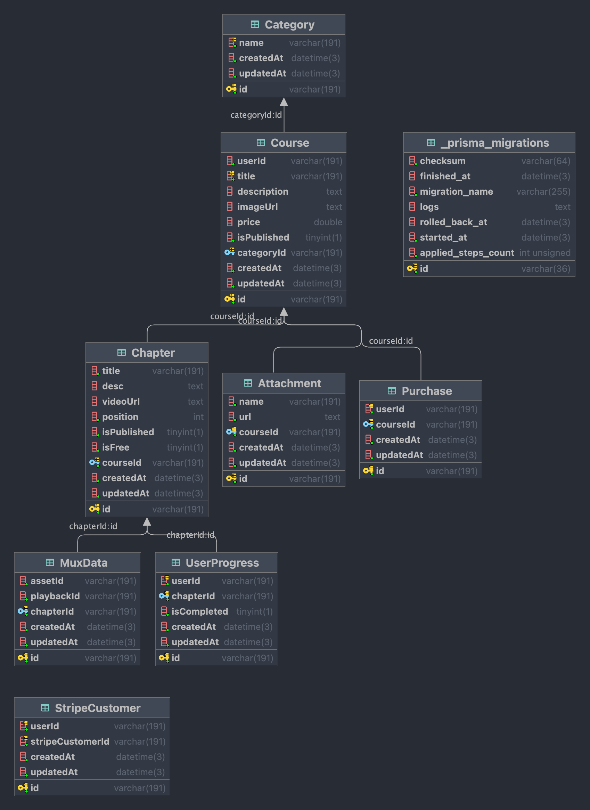

Learn NEXTJS-LMS from channel Code With Antonio
```
link channel youtube: https://www.youtube.com/watch?v=Big_aFLmekI&t=804s&ab_channel=CodeWithAntonio
```

## Main Features: 
- [x] NextJS Typescript
- [x] TailwindCSS
- [x] Clerk Auth
- [x] Stripe Payment Gateway
- [x] Multi language using Zustand (indonesian & english)
- [x] Role based access control

### fill .env file
```
NEXT_PUBLIC_CLERK_PUBLISHABLE_KEY=
CLERK_SECRET_KEY=

NEXT_PUBLIC_CLERK_SIGN_IN_URL=
NEXT_PUBLIC_CLERK_SIGN_UP_URL=
NEXT_PUBLIC_CLERK_AFTER_SIGN_IN_URL=
NEXT_PUBLIC_CLERK_AFTER_SIGN_UP_URL=

UPLOADTHING_SECRET=
UPLOADTHING_APP_ID=

MUX_TOKEN_ID=
MUX_TOKEN_SECRET=

STRIPE_SECRET_KEY= 
STRIPE_WEBHOOK_SECRET=

NEXT_PUBLIC_APP_URL=

NEXT_PUBLIC_TEACHER_ID=
```

### ERD table LMS MySQL
image

